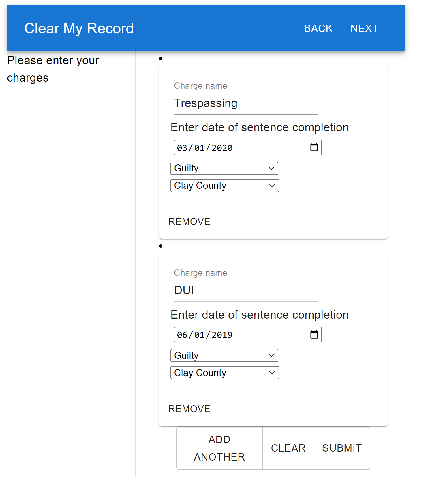
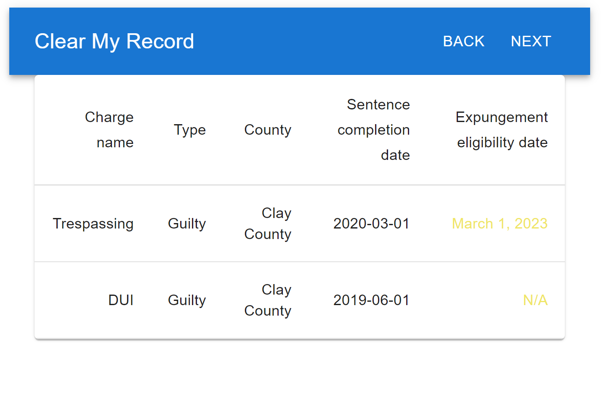

# Clear My Record
Based on [Clear My Record](https://github.com/codeforkansascity/KS-CMR), a project to help people in Kansas figure out if criminal charges are eligible to be expunged from their record, and print out the necessary paperwork.
## Demo
[Click here to open the application live](http://45.153.48.223:3000/)
## Screenshots
<table>
  <tr>
    <td valign="top"></td>
    <td valign="top"></td>
  </tr>
</table>

## Built With
* [React](https://reactjs.org/docs/getting-started.html)
* [Redux Toolkit](https://redux-toolkit.js.org/introduction/getting-started)
* [Material UI](https://mui.com/material-ui/getting-started/overview/)
* [React Hook Form](https://react-hook-form.com/get-started)

